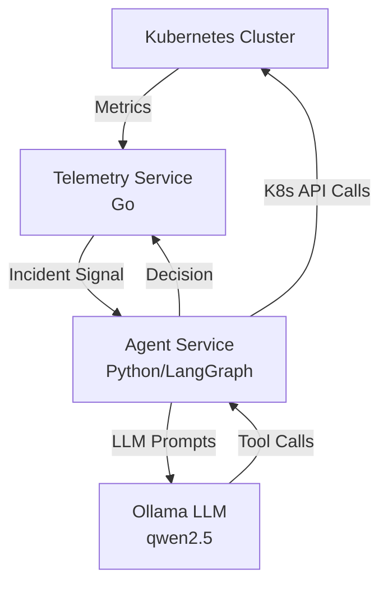
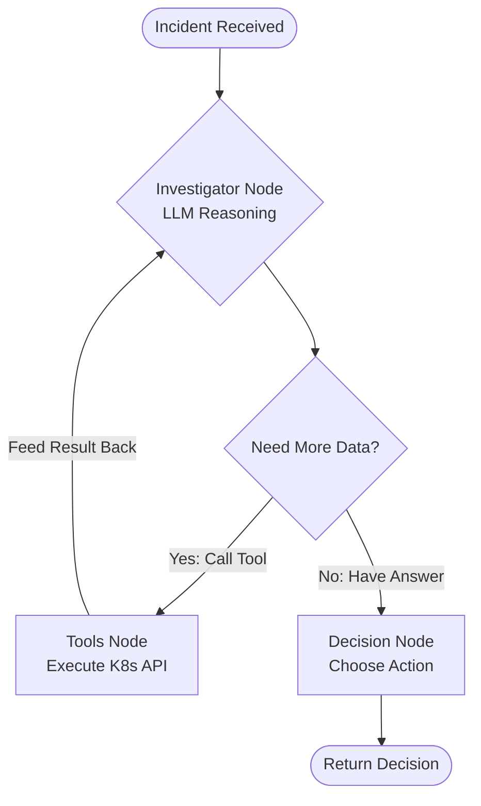
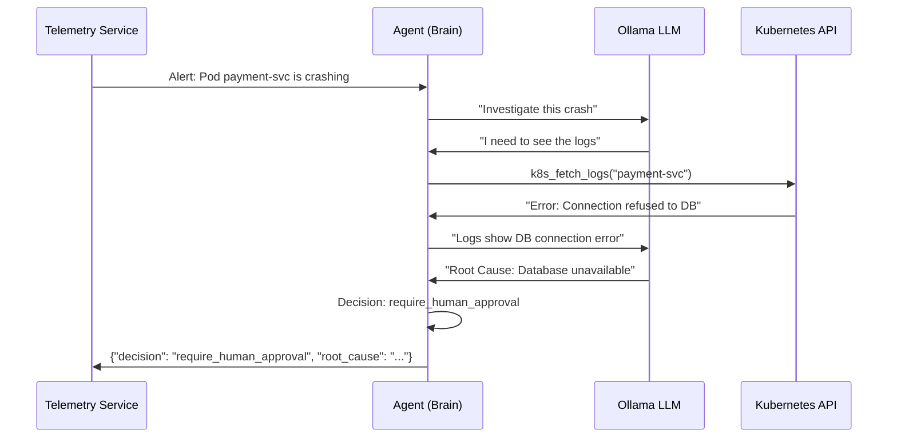
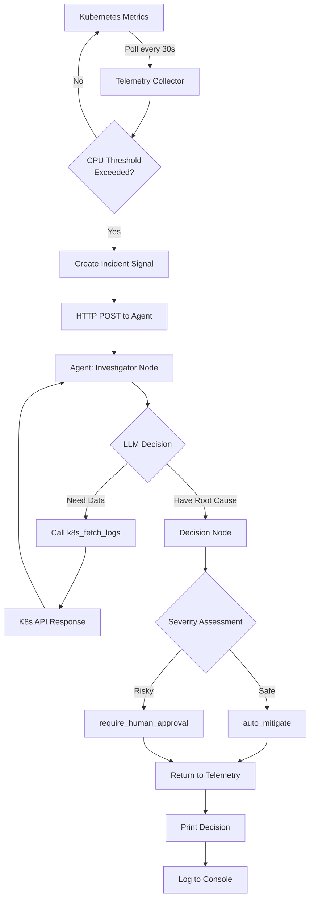

# Agentic-Logs-Analyzer

> An intelligent Kubernetes observability and incident response system powered by AI agents with investigative capabilities.

## Overview

This project implements an autonomous SRE system that monitors Kubernetes clusters, detects anomalies, and uses a **ReAct Agent** (Reasoning + Acting) to investigate incidents using real cluster data before making remediation decisions.

## Architecture

### High-Level System Flow



### Component Breakdown

| Service | Technology | Purpose |
|---------|-----------|---------|
| **Telemetry Service** | Go 1.22+ | Polls Kubernetes metrics, detects anomalies (CPU spikes, OOM, crashes), and publishes incident signals |
| **Agent Service** | Python 3.11+, FastAPI, LangGraph | ReAct agent that receives incidents, investigates using K8s tools, and decides actions |
| **Ollama Service** | Ollama + qwen2.5:0.5b | Local LLM for reasoning and tool-calling capabilities |

---

## ReAct Agent Workflow

The Agent Service implements a **ReAct (Reasoning + Acting)** loop, allowing the AI to investigate incidents like a human SRE would.

### Agent Flow Diagram



### Available Tools

The agent has access to these Kubernetes investigation tools:

| Tool | Function | Use Case |
|------|----------|----------|
| `k8s_list_pods` | Lists all pods in a namespace | When the agent doesn't know which pod is failing |
| `k8s_get_pod_health` | Gets pod status, restart count, and K8s events | To diagnose CrashLoopBackOff, Pending, or OOMKilled states |
| `k8s_fetch_logs` | Retrieves the last N lines of pod logs | To identify root cause from application errors |

### Example Investigation Flow



---

## Quick Start

### Prerequisites

- **Docker** (for building images)
- **Minikube** (local Kubernetes cluster)
- **kubectl** (Kubernetes CLI)
- **Make** (build automation)
- **Python 3.11+** (for local agent development)
- **Go 1.22+** (for local telemetry development)

### 1. Deploy to Kubernetes

```bash
# Start Minikube
minikube start

# Build all Docker images
make build-all

# Deploy all services
make deploy-all

# Verify deployment
kubectl get pods
```

Expected output:
```
NAME                                READY   STATUS    RESTARTS
agent-service-xxxxx-xxxxx          1/1     Running   0
ollama-xxxxx-xxxxx                 1/1     Running   0
telemetry-service-xxxxx-xxxxx      1/1     Running   0
```

### 2. Local Development

**Telemetry Service:**
```bash
cd telemetry-service
make local-telemetry
```

**Agent Service:**
```bash
cd agent-service
python -m venv venv
.\venv\Scripts\activate  # Windows
# source venv/bin/activate  # Linux/Mac
pip install -r requirements.txt
uvicorn main:app --reload --port 8080
```

---

## Configuration

### Telemetry Service (Go)

Configured via `telemetry-service/deployments/configmap.yaml`:

| Variable | Default | Description |
|----------|---------|-------------|
| `SERVICE_NAME` | `telemetry-service` | Service identifier |
| `POLL_INTERVAL` | `30` | Metrics collection interval (seconds) |
| `EVENT_SINK_URL` | `http://agent-service/events` | Agent API endpoint |
| `EVENT_TIMEOUT` | `180` | HTTP timeout for agent calls (seconds) |
| `CPU_THRESHOLD` | `50.0` | CPU usage threshold for alerting (millicores) |
| `HTTP_PORT` | `8080` | Health check server port |

### Agent Service (Python)

Configured via `agent-service/deployments/configmap.yaml`:

| Variable | Default | Description |
|----------|---------|-------------|
| `OLLAMA_MODEL` | `qwen2.5:0.5b` | LLM model to use |
| `OLLAMA_BASE_URL` | `http://ollama-service:11434` | Ollama API endpoint |
| `OLLAMA_TEMPERATURE` | `0.1` | LLM creativity (0=deterministic, 1=creative) |
| `OLLAMA_NUM_CTX` | `2048` | Context window size |
| `OLLAMA_TIMEOUT` | `60` | LLM request timeout (seconds) |

---

## Data Flow

### Complete Incident Lifecycle



---

## Makefile Commands

### Build Commands

```bash
make build-telemetry      # Build telemetry-service Docker image
make build-agent          # Build agent-service Docker image
make build-all           # Build all images
```

### Deployment Commands

```bash
make deploy-ollama       # Deploy Ollama LLM service
make deploy-telemetry    # Deploy telemetry service
make deploy-agent        # Deploy agent service
make deploy-all          # Deploy everything in correct order
```

### Cleanup Commands

```bash
make stop-all            # Delete all Kubernetes resources
make clean               # Remove local Docker images
```

### Utility Commands

```bash
make port-forward        # Forward Ollama port to localhost:11434
make logs-telemetry      # Tail telemetry service logs
make logs-agent          # Tail agent service logs
```

---

## Testing the System

### 1. Send a Test Incident

```bash
# Port-forward the agent service
kubectl port-forward svc/agent-service 8080:80

# In another terminal, send a test event
curl -X POST http://localhost:8080/events \
  -H "Content-Type: application/json" \
  -d '{
    "id": "test-001",
    "type": "cpu_spike",
    "severity": "critical",
    "namespace": "default",
    "resource": "pod/nginx-xxx",
    "message": "CPU usage at 95%",
    "timestamp": "2026-01-07T10:00:00Z",
    "source": "test-client"
  }'
```

### 2. Monitor Agent Logs

```bash
# Watch the agent investigate
kubectl logs -f deployment/agent-service

# You should see:
# - "NEW INCIDENT DETECTED"
# - Tool calls (k8s_fetch_logs, k8s_get_pod_health)
# - "Root Cause: ..."
# - "Decision: auto_mitigate" or "require_human_approval"
```

### 3. Monitor Telemetry Logs

```bash
kubectl logs -f deployment/telemetry-service

# You should see:
# - " Event published [cpu_spike]"
# - "--- Agent Response ---"
# - "Decision: ..."
```

---

## Project Structure

```
.
├── Makefile                          # Orchestration commands
├── README.md                         # This file
│
├── agent-service/                    # AI Agent (Python/LangGraph)
│   ├── Dockerfile
│   ├── requirements.txt
│   ├── main.py                       # FastAPI entry point
│   ├── agent.py                      # LangGraph state machine
│   ├── nodes.py                      # Investigator & Decision nodes
│   ├── llm.py                        # Ollama LLM configuration
│   ├── tools.py                      # Kubernetes investigation tools
│   ├── model.py                      # Pydantic state models
│   ├── logger.py                     # Logging setup
│   └── deployments/
│       ├── configmap.yaml
│       └── agent.yaml                # Kubernetes deployment
│
├── telemetry-service/                # Metrics Collector (Go)
│   ├── Dockerfile
│   ├── go.mod
│   ├── cmd/server/
│   │   └── main.go                   # Entry point
│   └── internal/
│       ├── config/                   # Environment configuration
│       ├── k8s/                      # Kubernetes client
│       ├── metrics/                  # Metrics collectors
│       ├── detectors/                # Anomaly detectors
│       ├── events/                   # Event publisher
│       ├── scheduler/                # Polling scheduler
│       └── deployments/
│           ├── configmap.yaml
│           └── telemetry.yaml        # Kubernetes deployment
│
└── ollama/                           # LLM Service
    ├── Makefile
    └── ollama.yaml                   # Kubernetes deployment
```

---

## RBAC Permissions

The Agent Service requires Kubernetes API access to investigate incidents. When deploying to production, apply the RBAC policy:

```yaml
# agent-service/deployments/agent-rbac.yaml
apiVersion: v1
kind: ServiceAccount
metadata:
  name: agent-service-account
---
apiVersion: rbac.authorization.k8s.io/v1
kind: ClusterRole
metadata:
  name: sre-agent-role
rules:
  - apiGroups: [""]
    resources: ["pods", "pods/log", "events"]
    verbs: ["get", "list"]
---
apiVersion: rbac.authorization.k8s.io/v1
kind: ClusterRoleBinding
metadata:
  name: sre-agent-binding
subjects:
- kind: ServiceAccount
  name: agent-service-account
  namespace: default
roleRef:
  kind: ClusterRole
  name: sre-agent-role
  apiGroup: rbac.authorization.k8s.io
```

Deploy it:
```bash
kubectl apply -f agent-service/deployments/agent-rbac.yaml
```

---

## How the ReAct Agent Works

### Normal Linear Agent (Old)
```
Alert → Classify → Decide → Done
```
*Problem: The agent "guesses" the root cause without verification.*

### ReAct Agent (New)
```
Alert → Think → Tool → Observe → Think → Tool → ... → Decide → Done
```
*Solution: The agent fetches real data before making decisions.*

### Code Example

When an alert arrives, the agent:

1. **Receives context:**
   ```
   "Pod payment-svc is in CrashLoopBackOff. Restart count: 5."
   ```

2. **Thinks (LLM Reasoning):**
   ```
   "I should check the logs to see why it's crashing."
   ```

3. **Acts (Tool Call):**
   ```python
   k8s_fetch_logs("payment-svc", namespace="default", lines=50)
   ```

4. **Observes (Tool Result):**
   ```
   "Error: ECONNREFUSED - Cannot connect to postgres:5432"
   ```

5. **Analyzes (LLM Reasoning):**
   ```
   "Root Cause: Database connection failure. Decision: require_human_approval"
   ```

---

## Learning Outcomes

This project demonstrates:

 **LangGraph** for building stateful AI agents  
 **Tool Calling** (Function Calling) with LLMs  
 **ReAct Pattern** (Reasoning + Acting in a loop)  
 **Kubernetes Client Libraries** (Python & Go)  
 **Microservices Architecture** with FastAPI and Go  
 **Local LLM Deployment** with Ollama  
 **ConfigMap-driven Configuration** in Kubernetes  

---

## Future Enhancements

- [ ] **Human-in-the-Loop (HITL)**: Pause workflow for approval via Slack/Teams
- [ ] **Self-Healing Loop**: Verify if remediation worked, retry if failed
- [ ] **Multi-Agent System**: Specialized agents for DB, Network, Storage
- [ ] **RAG Integration**: Search past incidents from vector DB
- [ ] **Prometheus Integration**: Richer metrics beyond CPU
- [ ] **Graph Visualization**: UI to show agent decision tree

---

## License

MIT License - Feel free to use this for learning and experimentation.

---

## Acknowledgments

Built with:
- [LangGraph](https://github.com/langchain-ai/langgraph) - Agent orchestration
- [Ollama](https://ollama.ai/) - Local LLM inference
- [Kubernetes Python Client](https://github.com/kubernetes-client/python)
- [FastAPI](https://fastapi.tiangolo.com/)

---

**Made with ️ by Mohamed Aslam** | [GitHub](https://github.com/Mohamedaslam227/AI-Logs-Analyzer)
