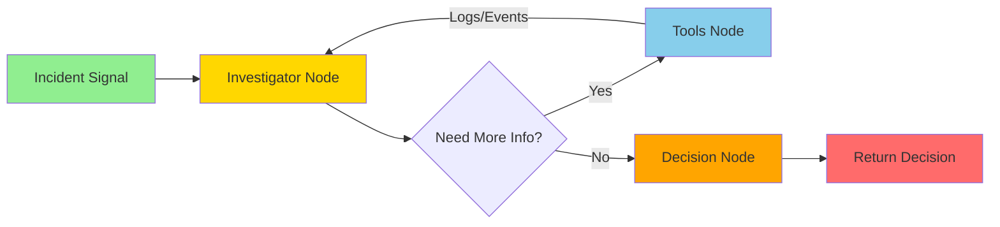

# Agent Service

> AI-powered Kubernetes incident investigation and decision-making service using LangGraph and ReAct pattern.

## 🎯 Overview

The Agent Service is a Python-based FastAPI application that acts as an intelligent SRE assistant. It receives incident signals from the Telemetry Service and uses a **ReAct Agent** (Reasoning + Acting) to investigate issues by interacting with the Kubernetes API before making remediation decisions.

## 🏗️ Architecture

### ReAct Agent Flow



### Components

| File | Purpose |
|------|---------|
| `main.py` | FastAPI application entry point |
| `agent.py` | LangGraph state machine (graph construction) |
| `nodes.py` | Agent nodes (Investigator, Decision) |
| `tools.py` | Kubernetes investigation tools |
| `llm.py` | Ollama LLM configuration |
| `model.py` | Pydantic data models (State & Signals) |
| `logger.py` | Logging configuration |

## 🔧 How It Works

### 1. Receive Incident

The `/events` endpoint receives JSON signals from the Telemetry Service:

```json
{
  "id": "evt-001",
  "type": "cpu_spike",
  "severity": "critical",
  "namespace": "default",
  "resource": "pod/payment-svc-xxx",
  "message": "CPU usage at 95%",
  "timestamp": "2026-01-07T10:00:00Z",
  "source": "telemetry-service"
}
```

### 2. Investigation (Investigator Node)

The agent enters a **thought loop**:

```python
# System Prompt enforces this protocol:
1. REVIEW: Read the incident details
2. THOUGHT: "I need to check the logs to see why CPU is high"
3. ACTION: Call k8s_fetch_logs("payment-svc-xxx")
4. OBSERVATION: Read tool output
5. ANALYSIS: Determine root cause from the logs
6. FINAL ANSWER: "Root cause is a slow DB query causing high CPU"
```

### 3. Available Tools

| Tool | Description | Example Use |
|------|-------------|-------------|
| `k8s_list_pods` | Lists all pods in a namespace | Find failing pods when resource name is vague |
| `k8s_get_pod_health` | Gets pod status, restarts, and K8s events | Diagnose CrashLoopBackOff, OOMKilled states |
| `k8s_fetch_logs` | Retrieves last N lines of pod logs | Identify application errors |

### 4. Decision Making

After investigation, the `Decision Node` classifies the action:

- **`auto_mitigate`**: Safe to automatically fix (e.g., restart pod)
- **`require_human_approval`**: Risky or uncertain (e.g., data corruption suspected)

### 5. Response

Returns to Telemetry Service:

```json
{
  "message": "Event received",
  "decision": "require_human_approval"
}
```

## 🚀 Setup

### Local Development

```bash
# Create virtual environment
python -m venv venv

# Activate (Windows)
.\venv\Scripts\activate

# Activate (Linux/Mac)
source venv/bin/activate

# Install dependencies
pip install -r requirements.txt

# Run the service
uvicorn main:app --reload --port 8080
```

### Docker Build

```bash
# From project root
make build-agent
```

### Deploy to Kubernetes

```bash
# From project root
make deploy-agent
```

## ⚙️ Configuration

All configuration is managed via environment variables (or ConfigMap in Kubernetes).

| Variable | Default | Description |
|----------|---------|-------------|
| `OLLAMA_MODEL` | `qwen2.5:0.5b` | LLM model to use for reasoning |
| `OLLAMA_BASE_URL` | `http://ollama-service:11434` | Ollama service endpoint |
| `OLLAMA_TEMPERATURE` | `0.1` | LLM temperature (0=deterministic, 1=creative) |
| `OLLAMA_NUM_CTX` | `2048` | Context window size |
| `OLLAMA_TIMEOUT` | `60` | LLM request timeout (seconds) |

### Example ConfigMap

```yaml
apiVersion: v1
kind: ConfigMap
metadata:
  name: agent-config
data:
  OLLAMA_MODEL: "qwen2.5:0.5b"
  OLLAMA_BASE_URL: "http://ollama-service:11434"
  OLLAMA_TEMPERATURE: "0.1"
  OLLAMA_NUM_CTX: "2048"
  OLLAMA_TIMEOUT: "60"
```

## 🧪 Testing

### 1. Test Locally

```bash
# Start the service
uvicorn main:app --reload --port 8080

# In another terminal, send a test incident
curl -X POST http://localhost:8080/events \
  -H "Content-Type: application/json" \
  -d '{
    "id": "test-001",
    "type": "pod_crash",
    "severity": "high",
    "namespace": "default",
    "resource": "nginx-xxx",
    "message": "Pod is in CrashLoopBackOff",
    "timestamp": "2026-01-07T10:00:00Z",
    "source": "test"
  }'
```

### 2. Test in Kubernetes

```bash
# Port-forward the service
kubectl port-forward svc/agent-service 8080:80

# Send test event
curl -X POST http://localhost:8080/events \
  -H "Content-Type: application/json" \
  -d @sample_payload_crash.json

# Check logs
kubectl logs -f deployment/agent-service
```

### Expected Output

```
INFO:     Event received | type=pod_crash severity=high resource=nginx-xxx source=test
INFO:     NEW INCIDENT DETECTED
INFO:     Tool Call: k8s_fetch_logs(pod_name='nginx-xxx')
INFO:     Tool Result: "Error: ECONNREFUSED - Cannot connect to backend:8080"
INFO:     Agent Decision: require_human_approval
INFO:     Root Cause: Backend service is unreachable, causing pod to crash
```

## 📊 State Management

The agent uses `IncidentState` to track the investigation:

```python
class IncidentState(BaseModel):
    event_type: str          # Type of incident
    severity: str            # Severity level
    resource: str            # K8s resource identifier
    message: str             # Alert message
    
    root_cause: str = None   # Determined root cause
    decision: str = None     # Final action decision
    messages: list = []      # Conversation history (for ReAct loop)
```

This state is passed through the graph:
1. **Investigator** adds `messages` (LLM thoughts + tool results)
2. **Decision** extracts the final `root_cause` and sets `decision`

## 🔐 RBAC Requirements

The agent needs Kubernetes API permissions. Apply this before deployment:

```yaml
# deployments/agent-rbac.yaml
apiVersion: v1
kind: ServiceAccount
metadata:
  name: agent-service-account
---
apiVersion: rbac.authorization.k8s.io/v1
kind: ClusterRole
metadata:
  name: sre-agent-role
rules:
  - apiGroups: [""]
    resources: ["pods", "pods/log", "events"]
    verbs: ["get", "list"]
---
apiVersion: rbac.authorization.k8s.io/v1
kind: ClusterRoleBinding
metadata:
  name: sre-agent-binding
subjects:
- kind: ServiceAccount
  name: agent-service-account
  namespace: default
roleRef:
  kind: ClusterRole
  name: sre-agent-role
  apiGroup: rbac.authorization.k8s.io
```

Apply:
```bash
kubectl apply -f deployments/agent-rbac.yaml
```

Update `deployments/agent.yaml` to use the service account:
```yaml
spec:
  template:
    spec:
      serviceAccountName: agent-service-account
```

## 🧠 Understanding the ReAct Pattern

### Traditional Approach (Linear)
```
Alert → LLM Guess → Decision → Done
```
❌ Problem: No verification, purely speculative.

### ReAct Approach (Loop)
```
Alert → Think → Tool → Observe → Think → Decide → Done
```
✅ Benefit: Evidence-based decisions using real cluster data.

### Code Example

**Prompt to LLM (System Message):**
```
You are a Senior SRE Agent.

YOUR PROTOCOL:
1. REVIEW the incident details.
2. THOUGHT: Create a plan. What do I need to check?
3. ACTION: Call the appropriate tool.
4. OBSERVATION: The tool will return data. READ IT CAREFULLY.
5. ANALYSIS: Based on the tool output, determine the root cause.
6. FINAL ANSWER: Provide a concise explanation.

DO NOT stop after calling a tool. You MUST analyze the result.
```

**LLM Response (First Turn):**
```json
{
  "tool_calls": [
    {
      "name": "k8s_fetch_logs",
      "arguments": {"pod_name": "nginx-xxx", "lines": 50}
    }
  ]
}
```

**Tool Result:**
```
Error: ECONNREFUSED - Cannot connect to backend:8080
```

**LLM Response (Second Turn):**
```
Root Cause: The pod is crashing because it cannot connect to the backend service.
This is a dependency failure, not a problem with the pod itself.
```

## 🚧 Future Enhancements

- [ ] **Human-in-the-Loop**: Integrate with Slack for approval workflows
- [ ] **Self-Healing Verification**: Check if the fix worked after applying
- [ ] **Remediation Tools**: Add `k8s_restart_pod`, `k8s_scale_deployment`
- [ ] **RAG Integration**: Search past incidents from a vector database
- [ ] **Multi-Agent System**: Specialized agents for different resource types

## 📚 Dependencies

```txt
fastapi              # Web framework
uvicorn              # ASGI server
python-dotenv        # Environment variable loading
requests             # HTTP client
pydantic             # Data validation
langgraph            # Agent orchestration
langchain-community  # LangChain integrations
langchain-ollama     # Ollama LLM wrapper
kubernetes           # Kubernetes API client
```

## 🐛 Troubleshooting

### Issue: "OllamaLLM object has no attribute 'bind_tools'"

**Solution:** You're using `OllamaLLM` instead of `ChatOllama`. Update `llm.py`:
```python
from langchain_ollama import ChatOllama  # Not OllamaLLM

def get_llm():
    return ChatOllama(...)  # Chat models support tool binding
```

### Issue: "Failed to load cluster configs"

**Solution:** Ensure you're either:
- Running inside a Kubernetes pod with RBAC permissions
- Running locally with a valid `~/.kube/config` file

### Issue: Agent doesn't analyze tool results

**Solution:** Check the System Message in `nodes.py`. It must explicitly tell the LLM to analyze tool outputs, not just call them.

## 📝 API Reference

### `GET /`
Health check endpoint.

**Response:**
```json
{
  "message": "Welcome to the Agent Service"
}
```

### `POST /events`
Receive and process incident signals.

**Request Body:**
```json
{
  "id": "string",
  "type": "string",
  "severity": "string",
  "namespace": "string (optional)",
  "resource": "string",
  "message": "string",
  "timestamp": "string (ISO 8601)",
  "metadata": {},
  "source": "string"
}
```

**Response:**
```json
{
  "message": "Event received",
  "decision": "auto_mitigate | require_human_approval"
}
```

---

**Built with LangGraph + Ollama** | Part of the AI DevOps SRE Assistant project
