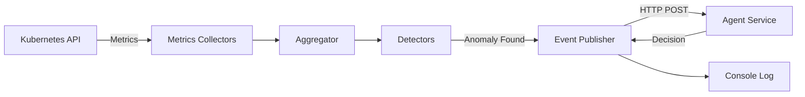
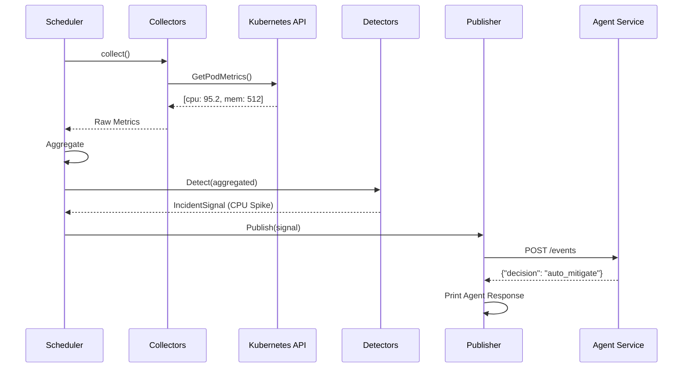

# Telemetry Service

> Kubernetes metrics collector and anomaly detection service written in Go.

## Overview

The Telemetry Service is a Go-based monitoring system that continuously polls Kubernetes cluster metrics, detects anomalies (such as CPU spikes, OOM events, and crashes), and publishes incident signals to the Agent Service for AI-powered investigation and remediation.

## Architecture



## Project Structure

```
telemetry-service/
├── cmd/
│   └── server/
│       └── main.go              # Application entry point
├── internal/
│   ├── config/
│   │   └── config.go            # Configuration loader
│   ├── k8s/
│   │   └── client.go            # Kubernetes API client
│   ├── metrics/
│   │   ├── collector.go         # Collector interface
│   │   ├── cpu_collector.go     # CPU metrics collector
│   │   └── aggregator.go        # Metrics aggregation
│   ├── detectors/
│   │   ├── detector.go          # Detector interface & models
│   │   └── cpu_spike.go         # CPU spike detector
│   ├── events/
│   │   ├── models.go            # Event models
│   │   └── publisher.go         # HTTP publisher to Agent
│   ├── scheduler/
│   │   └── scheduler.go         # Polling scheduler
│   └── health/
│       └── server.go            # Health check HTTP server
├── deployments/
│   ├── configmap.yaml           # Kubernetes ConfigMap
│   └── telemetry.yaml           # Kubernetes Deployment
├── Dockerfile
├── go.mod
└── README.md
```

## How It Works

### 1. Metrics Collection

The scheduler runs a polling loop every `POLL_INTERVAL` seconds:

```go
// Pseudocode
for {
    metrics := collectMetrics()  // Query K8s API for pod metrics
    aggregated := aggregate(metrics)
    
    for _, detector := range detectors {
        if signal, found := detector.Detect(aggregated); found {
            publisher.Publish(signal)  // Send to Agent Service
        }
    }
    
    sleep(POLL_INTERVAL)
}
```

### 2. CPU Metrics Collector

```go
// Collects CPU usage for all pods
type CPUCollector struct {
    client *k8s.Client
}

func (c *CPUCollector) Collect() []Metric {
    // Query Kubernetes Metrics API
    metrics := client.GetPodMetrics()
    
    // Convert to internal format
    return []Metric{
        {
            Key: "cpu:default:nginx-xxx",
            Values: [95.2, 96.1, 94.8],  // millicores
        },
    }
}
```

### 3. Anomaly Detection

```go
// CPU Spike Detector
type CPUSpikeDetector struct {
    Threshold float64  // e.g., 50.0 millicores
}

func (d *CPUSpikeDetector) Detect(input SignalInput) (*IncidentSignal, bool) {
    for key, values := range input.Metrics {
        avg := average(values)
        if avg > d.Threshold {
            return &IncidentSignal{
                Type: SignalCPUSpike,
                Severity: ClassifySeverity(avg, d.Threshold),
                Resource: extractResource(key),
                Message: fmt.Sprintf("CPU spike detected: %.2f millicores", avg),
            }, true
        }
    }
    return nil, false
}
```

### 4. Event Publishing

When an anomaly is detected, it's sent to the Agent Service:

```go
func (p *Publisher) Publish(signal *IncidentSignal) error {
    // Convert to Event format
    event := Event{
        ID: uuid.New(),
        Type: signal.Type,
        Severity: signal.Severity,
        Resource: signal.Resource,
        Message: signal.Message,
    }
    
    // HTTP POST to Agent Service
    resp, err := http.Post(p.sinkURL, "application/json", event)
    
    // NEW: Print Agent's response
    var agentResponse map[string]interface{}
    json.NewDecoder(resp.Body).Decode(&agentResponse)
    
    fmt.Printf("--- Agent Response ---\n")
    fmt.Printf("Decision: %v\n", agentResponse["decision"])
    fmt.Printf("----------------------\n")
    
    return err
}
```

## Setup

### Local Development

```bash
# Install dependencies
go mod download

# Run the service
go run cmd/server/main.go
```

### Environment Variables

Set these before running locally:

```bash
export SERVICE_NAME=telemetry-service
export POLL_INTERVAL=30
export EVENT_SINK_URL=http://localhost:8080/events
export EVENT_TIMEOUT=180
export CPU_THRESHOLD=50.0
export HTTP_PORT=8080
```

### Docker Build

```bash
# From project root
make build-telemetry
```

### Deploy to Kubernetes

```bash
# From project root
make deploy-telemetry
```

## Configuration

All configuration is managed via environment variables.

| Variable | Default | Description |
|----------|---------|-------------|
| `SERVICE_NAME` | `telemetry-service` | Service identifier for logging |
| `ENVIRONMENT` | `production` | Environment tag (`dev`/`staging`/`production`) |
| `POLL_INTERVAL` | `30` | Metrics collection interval (seconds) |
| `EVENT_SINK_URL` | `http://agent-service/events` | Agent Service API endpoint |
| `EVENT_TIMEOUT` | `180` | HTTP timeout for agent calls (seconds) |
| `CPU_THRESHOLD` | `50.0` | CPU usage threshold (millicores) for alerting |
| `HTTP_PORT` | `8080` | Health check server port |

### Example ConfigMap

```yaml
apiVersion: v1
kind: ConfigMap
metadata:
  name: telemetry-config
data:
  SERVICE_NAME: "telemetry-service"
  ENVIRONMENT: "production"
  POLL_INTERVAL: "30"
  EVENT_SINK_URL: "http://agent-service/events"
  EVENT_TIMEOUT: "180"
  CPU_THRESHOLD: "50.0"
  HTTP_PORT: "8080"
```

## Testing

### 1. Test Locally

```bash
# Start the service
go run cmd/server/main.go

# In another terminal, check health
curl http://localhost:8080/health
```

Expected output:
```json
{
  "status": "healthy",
  "service": "telemetry-service",
  "timestamp": "2026-01-07T10:00:00Z"
}
```

### 2. Trigger a CPU Spike (Minikube)

```bash
# Deploy a CPU stress pod
kubectl run stress --image=polinux/stress -- stress --cpu 2

# Watch telemetry logs
kubectl logs -f deployment/telemetry-service
```

Expected log output:
```
Cycle started
Collected 15 metrics
 Event published [cpu_spike] severity=high resource=pod/stress

--- Agent Response ---
Decision: require_human_approval
Message: Event received
----------------------

Cycle completed in 1.2s
```

### 3. Manual Event Testing

Since the telemetry service automatically publishes to the agent, you can verify the integration by checking if CPU spikes are detected and sent.

## Metrics Flow



## Detectors

### CPU Spike Detector

**Trigger Condition:**
```
Average CPU usage > CPU_THRESHOLD (millicores)
```

**Severity Classification:**
- `critical`: CPU ≥ 1.5× threshold
- `high`: CPU ≥ 1.2× threshold
- `medium`: CPU ≥ 1.1× threshold
- `low`: CPU > threshold

**Example:**
```
Threshold = 50.0 millicores

Pod A: 80 millicores → Severity: high (1.6× threshold)
Pod B: 95 millicores → Severity: critical (1.9× threshold)
```

### Adding New Detectors

1. Create a new file in `internal/detectors/`:
   ```go
   // oom_detector.go
   type OOMDetector struct {}
   
   func (d *OOMDetector) Name() string {
       return "oom_detector"
   }
   
   func (d *OOMDetector) Detect(input SignalInput) (*IncidentSignal, bool) {
       // Detection logic
   }
   ```

2. Register in `scheduler.go`:
   ```go
   s.detectors = []detectors.Detector{
       detectors.NewCPUSpikeDetector(s.cfg.CPUThreshold),
       detectors.NewOOMDetector(),  // New detector
   }
   ```

## RBAC Requirements

The Telemetry Service needs Kubernetes API read permissions:

```yaml
# deployments/telemetry-rbac.yaml
apiVersion: v1
kind: ServiceAccount
metadata:
  name: telemetry-service-account
---
apiVersion: rbac.authorization.k8s.io/v1
kind: ClusterRole
metadata:
  name: telemetry-role
rules:
  - apiGroups: [""]
    resources: ["pods", "nodes"]
    verbs: ["get", "list"]
  - apiGroups: ["metrics.k8s.io"]
    resources: ["pods", "nodes"]
    verbs: ["get", "list"]
---
apiVersion: rbac.authorization.k8s.io/v1
kind: ClusterRoleBinding
metadata:
  name: telemetry-binding
subjects:
- kind: ServiceAccount
  name: telemetry-service-account
  namespace: default
roleRef:
  kind: ClusterRole
  name: telemetry-role
  apiGroup: rbac.authorization.k8s.io
```

Apply:
```bash
kubectl apply -f deployments/telemetry-rbac.yaml
```

Update `deployments/telemetry.yaml`:
```yaml
spec:
  template:
    spec:
      serviceAccountName: telemetry-service-account
```

## Troubleshooting

### Issue: "Failed to load cluster configs"

**Symptoms:**
```
FATAL: Failed to load cluster configs: unable to load in-cluster configuration
```

**Solution:**
- **In-cluster**: Ensure RBAC is applied and `serviceAccountName` is set.
- **Local**: Ensure `~/.kube/config` exists and points to a valid cluster.

### Issue: "failed to publish event: connection refused"

**Symptoms:**
```
ERROR: failed to publish event: Post "http://agent-service/events": connection refused
```

**Solution:**
- Verify the Agent Service is running: `kubectl get pods -l app=agent-service`
- Check `EVENT_SINK_URL` is correct in ConfigMap.
- Test connectivity: `kubectl run test --rm -it --image=curlimages/curl -- curl http://agent-service/events`

### Issue: "Unable to fetch metrics from Kubernetes API server"

**Symptoms:**
```
ERROR: failed to get pod metrics: the server could not find the requested resource
```

**Solution:**
- Install Metrics Server in your cluster:
  ```bash
  kubectl apply -f https://github.com/kubernetes-sigs/metrics-server/releases/latest/download/components.yaml
  ```
- Verify it's running: `kubectl get deployment metrics-server -n kube-system`

## Performance Tuning

### Reduce Polling Interval (High-Frequency Monitoring)

```yaml
POLL_INTERVAL: "10"  # Poll every 10 seconds
```
️ **Warning:** May increase API server load.

### Increase CPU Threshold (Reduce False Positives)

```yaml
CPU_THRESHOLD: "100.0"  # Only alert if CPU > 100 millicores
```

### Increase Event Timeout (Slow Agent Response)

```yaml
EVENT_TIMEOUT: "300"  # Wait up to 5 minutes for Agent
```

## Future Enhancements

- [ ] **Memory Usage Detector**: Alert on high memory consumption
- [ ] **OOM Killer Detector**: Detect OOMKilled events
- [ ] **Crash Loop Detector**: Detect pods with high restart counts
- [ ] **Prometheus Integration**: Support Prometheus as a metrics source
- [ ] **Multi-Cluster Support**: Monitor multiple Kubernetes clusters
- [ ] **Metrics Buffering**: Store historical data for trend analysis

## Dependencies

```go
require (
    github.com/google/uuid v1.3.0           // UUID generation
    k8s.io/client-go v0.28.0                // Kubernetes client
    k8s.io/api v0.28.0                      // Kubernetes API types
    k8s.io/apimachinery v0.28.0             // Kubernetes machinery
    k8s.io/metrics v0.28.0                  // Metrics API client
)
```

## Unit Testing

Run tests:
```bash
go test ./internal/...
```

Example test for CPU Spike Detector:
```go
func TestCPUSpikeDetector(t *testing.T) {
    detector := NewCPUSpikeDetector(50.0)
    input := SignalInput{
        Metrics: map[string][]float64{
            "cpu:default:nginx": {95.2, 96.1, 94.8},
        },
    }
    
    signal, found := detector.Detect(input)
    assert.True(t, found)
    assert.Equal(t, SignalCPUSpike, signal.Type)
    assert.Equal(t, SeverityCritical, signal.Severity)
}
```

## API Reference

### Health Check

**Endpoint:** `GET /health`

**Response:**
```json
{
  "status": "healthy",
  "service": "telemetry-service",
  "timestamp": "2026-01-07T10:00:00Z"
}
```

### Metrics Endpoint (Optional)

If you want to expose Prometheus metrics, add:

```go
import "github.com/prometheus/client_golang/prometheus/promhttp"

http.Handle("/metrics", promhttp.Handler())
```

---

**Built with Go + Kubernetes Client** | Part of the AI DevOps SRE Assistant project